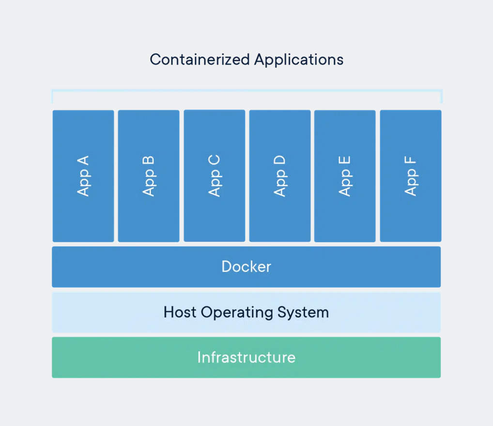
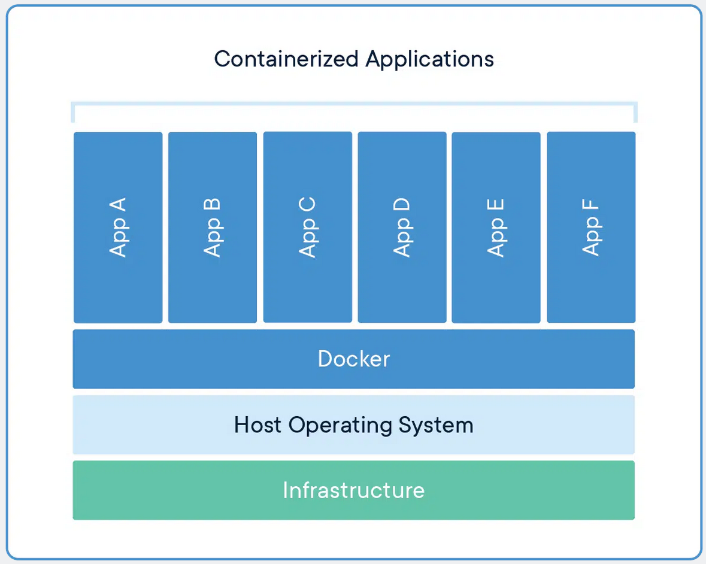
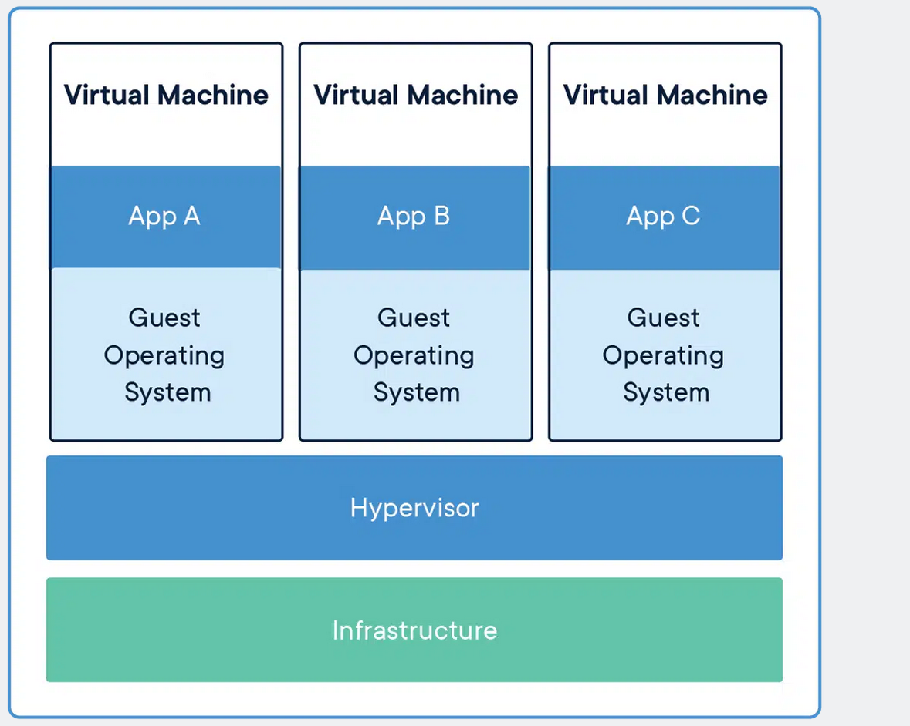

# Docker

## Content
- [Historic :clock7:](#historic-clock7)
- [General :whale:](#general-whale)
- [Comparison Containers vs VirtualMachine :repeat:](#comparison-containers-vs-virtualmachine-repeat)
- [Installation On Debian :computer:](#installation-on-debian-computer)
- [Dockerfile](#dockerfile)
- [Docker Run Command Line](#docker-run-command-line)	
- [Docker Compose](#docker-compose)
- [Cheat Section :trollface:](#cheat-section-trollface)
- [Sources :link:](#sources-link)

## Historic :clock7:
[Go to content](#content)
|Date _YYYY-MM-DD_|Description|
|:-|:-|
|2023-01-20|Init|

## General :whale:
[Go to content](#content)

Docker container image is a lightweight, standalone, executable package of software that includes everything needed to run an application: code, runtime, system tools, system libraries and settings.<br>
Container images become containers at runtime and in the case of Docker containers – images become containers when they run on Docker Engine. Available for both Linux and Windows-based applications, containerized software will always run the same, regardless of the infrastructure. Containers isolate software from its environment and ensure that it works uniformly despite differences for instance between development and staging.<br>
Docker containers that run on Docker Engine:
- ***Standard***: Docker created the industry standard for containers, so they could be portable anywhere.
- ***Lightweight***: Containers share the machine’s OS system kernel and therefore do not require an OS per application, driving higher server efficiencies and reducing server and licensing costs.
- ***Secure***: Applications are safer in containers and Docker provides the strongest default isolation capabilities in the industry.



It leveraged existing computing concepts around containers and specifically in the Linux world, primitives known as cgroups and namespaces. Docker’s technology is unique because it focuses on the requirements of developers and systems operators to separate application dependencies from infrastructure.<br>

> cgroups (abbreviated from control groups) is a Linux kernel feature that limits, accounts for, and isolates the resource usage (CPU, memory, disk I/O, network, etc.) of a collection of processes.
> Namespaces are a feature of the Linux kernel that partitions kernel resources such that one set of processes sees one set of resources while another set of processes sees a different set of resources. The feature works by having the same namespace for a set of resources and processes, but those namespaces refer to distinct resources. Resources may exist in multiple spaces. Examples of such resources are process IDs, host-names, user IDs, file names, and some names associated with network access, and Inter-process communication.<br>

## Comparison Containers vs VirtualMachine :repeat:
[Go to content](#content)

Containers and virtual machines have similar resource isolation and allocation benefits, but function differently because containers virtualize the operating system instead of hardware. Containers are more portable and efficient.<br>

### Containers
Containers are an abstraction at the app layer that packages code and dependencies together. Multiple containers can run on the same machine and share the OS kernel with other containers, each running as isolated processes in user space. Containers take up less space than VMs (container images are typically tens of MBs in size), can handle more applications and require fewer VMs and Operating systems.<br>



### VirtualMachine
Virtual machines (VMs) are an abstraction of physical hardware turning one server into many servers. The hypervisor allows multiple VMs to run on a single machine. Each VM includes a full copy of an operating system, the application, necessary binaries and libraries – taking up tens of GBs. VMs can also be slow to boot.<br>



## Installation On Debian :computer:
[Go to content](#content)

### Uninstall Docker Engine
Older versions of Docker went by the names of docker, docker.io, or docker-engine. Uninstall any such older versions before attempting to install a new version.
```
sudo apt-get remove docker docker-engine docker.io containerd runc
```

Uninstall the Docker Engine, CLI, containerd, and Docker Compose packages.
```
sudo apt-get purge docker-ce docker-ce-cli containerd.io docker-compose-plugin docker-ce-rootless-extras
```
Images, containers, volumes, or custom configuration files on your host aren’t automatically removed. To delete all images, containers, and volumes.
```
sudo rm -rf /var/lib/docker
sudo rm -rf /var/lib/containerd
```
Update the apt package index
```
sudo apt-get update
```
Install packages to allow apt to use a repository over HTTPS
```
sudo apt-get install \
    ca-certificates \
    curl \
    gnupg \
    lsb-release
```
Add Docker’s official GPG key
```
sudo mkdir -m 0755 -p /etc/apt/keyrings
curl -fsSL https://download.docker.com/linux/debian/gpg | sudo gpg --dearmor -o /etc/apt/keyrings/docker.gpg
```
Use the following command to set up the repository
```
echo \
  "deb [arch=$(dpkg --print-architecture) signed-by=/etc/apt/keyrings/docker.gpg] https://download.docker.com/linux/debian \
  $(lsb_release -cs) stable" | sudo tee /etc/apt/sources.list.d/docker.list > /dev/null
```

### Install Docker Engine
Your default umask may be incorrectly configured, preventing detection of the repository public key file. Try granting read permission for the Docker public key file before updating the package index.
```
sudo chmod a+r /etc/apt/keyrings/docker.gpg
sudo apt-get update
```
To install the latest version, run
```
sudo apt-get install docker-ce docker-ce-cli containerd.io docker-compose-plugin
```
Verify that the Docker Engine installation is successful by running the hello-world image
```
sudo docker run hello-world
```

### [Facultative] Get root access to your user
Create a \'docker\' group
```
sudo groupadd docker
```
Add your user to the group
```
sudo usermod -aG docker $USER
```
Restart your session or execute the following command
```
newgrp docker
```
Test the root access
```
docker run hello-world
```

## Dockerfile
[Go to content](#content)

Docker can build images automatically by reading the instructions from a Dockerfile. A Dockerfile is a text document that contains all the commands a user could call on the command line to assemble an image.<br>

### Good practice
Written sequence
1. FROM
2. MAINTAINER
3. ARG
4. ENV, LABEL
5. VOLUME
6. RUN, COPY, WORKDIR
7. EXPOSE
8. USER
9. ONBUILD
10. CMD,ENTRYPOINT
11. STOPSIGNAL ???
12. HEALTHCHECK ???

> :pushpin: For 'CMD/ENTRYPOINT', it is recommended to use exec synthax CMD ["xxx", "-y"]

Each instruction creates one layer:
- FROM creates a layer from the ubuntu:18.04 Docker image.
- COPY adds files from your Docker client’s current directory.
- RUN builds your application with make.
- CMD specifies what command to run within the container.
Then it is recommended to use "\\" to create layer as minimum as possible.

### Comment
Docker treats lines that begin with # as a comment, unless the line is a valid parser directive. A # marker anywhere else in a line is treated as an argument.<br>

### FROM
The FROM instruction initializes a new build stage and sets the Base Image for subsequent instructions. As such, a valid Dockerfile must start with a FROM instruction. The image can be any valid image – it is especially easy to start by pulling an image from the Public Repositories.<br>
```
FROM [--platform=<platform>] <image> [AS <name>]
FROM [--platform=<platform>] <image>[:<tag>] [AS <name>]
FROM [--platform=<platform>] <image>[@<digest>] [AS <name>]
```

> :pencil2: Example:<br>
> ````
> FROM debian:buster
> FROM nginx
> ````

### MAINTAINER
The MAINTAINER instruction sets the Author field of the generated images. The LABEL instruction is a much more flexible version of this and you should use it instead, as it enables setting any metadata you require, and can be viewed easily, for example with docker inspect.<br>
```
MAINTAINER abarrier
```

### ARG
The ARG instruction defines a variable that users can pass at build-time to the builder with the docker build command using the --build-arg <varname>=<value> flag. If a user specifies a build argument that was not defined in the Dockerfile, the build outputs a warning.<br>
```
ARG <name>[=<default value>]
```

> :warning: It is not recommended to use build-time variables for passing secrets like GitHub keys, user credentials etc. Build-time variable values are visible to any user of the image with the docker history command.<br>
> Refer to the RUN --mount=type=secret section to learn about secure ways to use secrets when building images.

### RUN
The RUN instruction will execute any commands in a new layer on top of the current image and commit the results. The resulting committed image will be used for the next step in the Dockerfile.<br>
Shell form, the command is run in a shell, which by default is /bin/sh -c on Linux or cmd /S /C on Windows:
```
RUN <command>
```
> :pencil2: Example:<br>
> ````
> RUN /bin/bash -c 'source $HOME/.bashrc; \
> ````

Exec form:
```
RUN ["executable", "param1", "param2"]
```
> :pencil2: Example:<br>
> ````
> RUN ["/bin/bash", "-c", "echo hello"]
> ````

### STOPSIGNAL
The STOPSIGNAL instruction sets the system call signal that will be sent to the container to exit. This signal can be a signal name in the format SIG<NAME>, for instance SIGKILL, or an unsigned number that matches a position in the kernel’s syscall table, for instance 9. The default is SIGTERM if not defined.<br>
```
STOPSIGNAL signal
```

### HEALTHCHECK
The HEALTHCHECK instruction tells Docker how to test a container to check that it is still working. This can detect cases such as a web server that is stuck in an infinite loop and unable to handle new connections, even though the server process is still running.<br>
```
HEALTHCHECK --interval=5m --timeout=3s \
  CMD curl -f http://localhost/ || exit 1
```

## Docker Run Command Line
[Go to content](#content)

The docker run command first creates a writeable container layer over the specified image, and then starts it using the specified command. That is, docker run is equivalent to the API /containers/create then /containers/(id)/start. A stopped container can be restarted with all its previous changes intact using docker start. See docker ps -a to view a list of all containers.<br>
```
docker run [OPTIONS] IMAGE [COMMAND] [ARG...]
```
***Options :wrench:***
|Name/Shorthand|Description|
|-|-|
|--attach , -a|Attach to STDIN, STDOUT or STDERR|
|--detach , -d|Run container in background and print container ID|
|--entrypoint|Overwrite the default ENTRYPOINT of the image|
|--env , -e|Set environment variables|
|--env-file|Read in a file of environment variables|
|--expose|Expose a port or a range of ports|
|--interactive , -i|Keep STDIN open even if not attached|
|--expose|Expose a port or a range of ports|Set meta data on a container|
|--name|Assign a name to the container|
|--restart	no|Restart policy to apply when a container exits|
|--rm|Automatically remove the container when it exits|
|--stop-signal|Signal to stop a container|
|--stop-timeout|Timeout (in seconds) to stop a container|
|--tty , -t|Allocate a pseudo-TTY|
|--user , -u|Username or UID (format: <name|uid>[:<group|gid>])|
|--volume , -v|Bind mount a volume|
|--volumes-from|Mount volumes from the specified container(s)|
|--workdir , -w|Working directory inside the container|

> :pencil2: Example:<br>
> Assign name and allocate pseudo-TTY (--name, -it)
> ````
> docker run --name test -it debian
> ````
> Set working directory (-w, --workdir)
> ````
> docker  run -w /path/to/dir/ -i -t  ubuntu pwd
> ````
> Mount volume (-v, --read-only) 
> ````
> docker run -v /doesnt/exist:/foo -w /foo -i -t ubuntu bash
> ````
> Publish or expose port (-p, --expose)
> ````
> docker run -p 127.0.0.1:80:8080/tcp ubuntu bash
> ````
> Set environment variables (-e, --env, --env-file)
> ````
> docker run -e MYVAR1 --env MYVAR2=foo --env-file ./env.list ubuntu bash
> ````
> Connect a container to a network (--network)
> ````
> docker network create my-net
> docker run -itd --network=my-net busybox
> ````
> Mount volumes from container (--volumes-from)
> ````
> docker run --volumes-from 777f7dc92da7 --volumes-from ba8c0c54f0f2:ro -i -t ubuntu pwd
> ````

### Restart policies
Use Docker’s --restart to specify a container’s restart policy. A restart policy controls whether the Docker daemon restarts a container after exit.<br>
```
docker run --restart=POLICY IMAGE [COMMAND] [ARG...]
```

***Policies :wrench:***
|Policy|Description|
|-|-|
|no|Do not automatically restart the container when it exits. This is the default.|
|on-failure[:max-retries]|Restart only if the container exits with a non-zero exit status. Optionally, limit the number of restart retries the Docker daemon attempts.|
|unless-stopped|Restart the container unless it is explicitly stopped or Docker itself is stopped or restarted.|
|always|Always restart the container regardless of the exit status. When you specify always, the Docker daemon will try to restart the container indefinitely. The container will also always start on daemon startup, regardless of the current state of the container.|

> :pencil2: Example:<br>
> ````
> docker run --restart=always redis
> ````

### Stop container with signal
The --stop-signal flag sets the system call signal that will be sent to the container to exit. This signal can be a signal name in the format SIG<NAME>, for instance SIGKILL, or an unsigned number that matches a position in the kernel’s syscall table, for instance 9.<br>

### Stop container with timeout
The --stop-timeout flag sets the number of seconds to wait for the container to stop after sending the pre-defined (see --stop-signal) system call signal. If the container does not exit after the timeout elapses, it is forcibly killed with a SIGKILL signal.<br>
If --stop-timeout is set to -1, no timeout is applied, and the daemon will wait indefinitely for the container to exit.<br>

## Docker Compose
[Go to content](#content)

The Compose file is a YAML file defining version (DEPRECATED), services (REQUIRED), networks, volumes, configs and secrets. The default path for a Compose file is compose.yaml (preferred) or compose.yml in working directory. Compose implementations SHOULD also support docker-compose.yaml and docker-compose.yml for backward compatibility. If both files exist, Compose implementations MUST prefer canonical compose.yaml one.<br>

### Usage
```
docker compose [-f <arg>...] [--profile <name>...] [options] [COMMAND] [ARGS...]
docker compose -h|--help
```
***Options :wrench:***
|Name/Shorthand|Description|
|-|-|
|--file, -f FILE|Specify an alternate compose file (default: docker-compose.yml)|
|--project-name, -p NAME|Specify an alternate project name (default: directory name)|
|--profile NAME|Specify a profile to enable|
|--verbose|Show more output|
|--log-level LEVEL|DEPRECATED and not working from 2.0 - Set log level (DEBUG, INFO, WARNING, ERROR, CRITICAL)|
|--no-ansi|Do not print ANSI control characters|
|--version, -v|Print version and exit|
|--host, -H HOST|Daemon socket to connect to|
|--tls|Use TLS; implied by --tlsverify|
|--tlscacert CA_PATH|Trust certs signed only by this CA|
|--tlscert CLIENT_CERT_PATH|Path to TLS certificate file|
|--tlskey TLS_KEY_PATH|Path to TLS key file|
|--tlsverify|Use TLS and verify the remote|
|--skip-hostname-check|Don't check the daemon's hostname against the name specified in the client certificate|
|--project-directory PATH|Specify an alternate working directory (default: the path of the Compose file)|
--compatibility|If set, Compose will attempt to convert deploy keys in v3 files to their non-Swarm equivalent|

***Commands:wrench:***
|Name/Shorthand|Description|
|-|-|
|build|Build or rebuild services|
|bundle|Generate a Docker bundle from the Compose file|
|config|Validate and view the Compose file|
|create|Create services|
|down|Stop and remove containers, networks, images, and volumes|
|events|Receive real time events from containers|
|exec|Execute a command in a running container|
|help|Get help on a command|
|images|List images|
|kill|Kill containers|
|logs|View output from containers|
|pause|Pause services|
|port|Print the public port for a port binding|
|ps|List containers|
|pull|Pull service images|
|push|Push service images|
|restart|Restart services|
|rm|Remove stopped containers|
|run|Run a one-off command|
|scale|Set number of containers for a service|
|start|Start services|
|stop|Stop services|
|top|Display the running processes|
|unpause|Unpause services|
|up|Create and start containers|
|version|Show the Docker Compose version information|

## Cheat Section :trollface:
[Go to content](#content)

Create and start a container
```
docker run [OPTIONS] IMAGE [COMMAND] [ARG...]
```
***Options :wrench:***
|Name/Shorthand|Description|
|-|-|
|--detach, -d|Run container in background and print container ID|
|--name|Assign a name to the container|
|--publish , -p|Publish a container's port(s) to the host|
|--volume , -v|Bind mount a volume|

Create an inactive container
```
docker create [OPTIONS] IMAGE [COMMAND] [ARG...]
```

Stop the container
```
docker stop [OPTIONS] CONTAINER [CONTAINER...]
```

Kill the container
```
docker kill [OPTIONS] CONTAINER [CONTAINER...]
```

Pause container
```
docker pause CONTAINER [CONTAINER...]
```

Unpause container
```
docker unpause CONTAINER [CONTAINER...]
```

List all containers
```
docker ps [OPTIONS]
```
***Options :wrench:***
|Name/Shorthand|Description|
|-|-|
|--all, -a|Show all containers (default shows just running)|

Destroy a container
```
docker rm [OPTIONS] CONTAINER [CONTAINER...]
```
> :pushpin: Container must be stopped before to be destroyed

Connect to an active container
```
docker exec [OPTIONS] CONTAINER COMMAND [ARG...]
```
***Options :wrench:***
|Name/Shorthand|Description|
|-|-|
|--tty, -t|Allocate a pseudo-TTY|
|--interactive, -i|Keep STDIN open even if not attached|

Create a volume
```
docker run [OPTIONS] -v <Container's directory> IMAGE 
```

Bind-mounting volume
```
docker run [OPTIONS] -v <Host directory>/<Container's directory> IMAGE 
```

Inspect an active container
```
docker inspect [OPTIONS] NAME|ID [NAME|ID...]
```

List all images
```
docker images [OPTIONS] [REPOSITORY[:TAG]]
```
|Name/Shorthand|Description|
|-|-|
|--all, -a|Show all containers (default shows just running)|

Destroy images
```
docker rmi [OPTIONS] IMAGE [IMAGE...]
```

Display the deamon configuration
```
docker info [INFOS]
```

Display containers informations
```
docker stats [OPTIONS] [CONTAINER...]
```

Display the version of the docker
```
docker version [OPTIONS]
```

Display log of container
```
docker logs [OPTIONS] CONTAINER
```
|Name/Shorthand|Description|
|-|-|
|--follow , -f|Follow log output|
|--tail, -n|Number of lines to show from the end of the logs|

Display top command inside a container
```
docker top CONTAINER [ps OPTIONS]
```

## Lexic
|Name|Description|
|-|-|
|CaaS|Container as a Service|
|IaaS|Infrastructure as a Service|
|UUID|Universally unique identifier|

## Sources :link:
[Go to content](#content)

### Docker Installation
- https://www.docker.com/resources/what-container/
- https://docs.docker.com/engine/install/debian/
- https://docs.docker.com/engine/install/linux-postinstall/

### Docker command line
- https://docs.docker.com/engine/reference/commandline/create/
- https://docs.docker.com/engine/reference/commandline/exec/
- https://docs.docker.com/engine/reference/commandline/images/
- https://docs.docker.com/engine/reference/commandline/info/
- https://docs.docker.com/engine/reference/commandline/inspect/
- https://docs.docker.com/engine/reference/commandline/kill/
- https://docs.docker.com/engine/reference/commandline/logs/
- https://docs.docker.com/engine/reference/commandline/pause/
- https://docs.docker.com/engine/reference/commandline/ps/
- https://docs.docker.com/engine/reference/commandline/rm/
- https://docs.docker.com/engine/reference/commandline/rmi/
- https://docs.docker.com/engine/reference/commandline/run/
- https://docs.docker.com/engine/reference/commandline/stats/
- https://docs.docker.com/engine/reference/commandline/stop/
- https://docs.docker.com/engine/reference/commandline/unpause/
- https://docs.docker.com/engine/reference/commandline/version/

### Dockerfile
- https://docs.docker.com/develop/develop-images/dockerfile_best-practices/
- https://docs.docker.com/engine/reference/builder/
- https://docs.docker.com/engine/reference/builder/#from
- https://docs.docker.com/engine/reference/builder/#run

### Docker Compose
- https://docs.docker.com/compose/compose-file/
- https://docs.docker.com/compose/reference/

### Miscellaneous
- https://en.wikipedia.org/wiki/Cgroups
- https://en.wikipedia.org/wiki/Linux\_namespaces
- https://en.wikipedia.org/wiki/Daemon\_\(computing\)
- https://fr.wikipedia.org/wiki/Universally\_unique\_identifier
- https://medium.com/freestoneinfotech/simplifying-docker-compose-operations-using-makefile-26d451456d63

### NGinx
- https://nginx.org/en/docs/beginners_guide.html
- https://nginx.org/en/docs/http/ngx_http_core_module.html#server
- https://nginx.org/en/docs/http/ngx_http_core_module.html#server
- https://nginx.org/en/docs/http/configuring_https_servers.html
