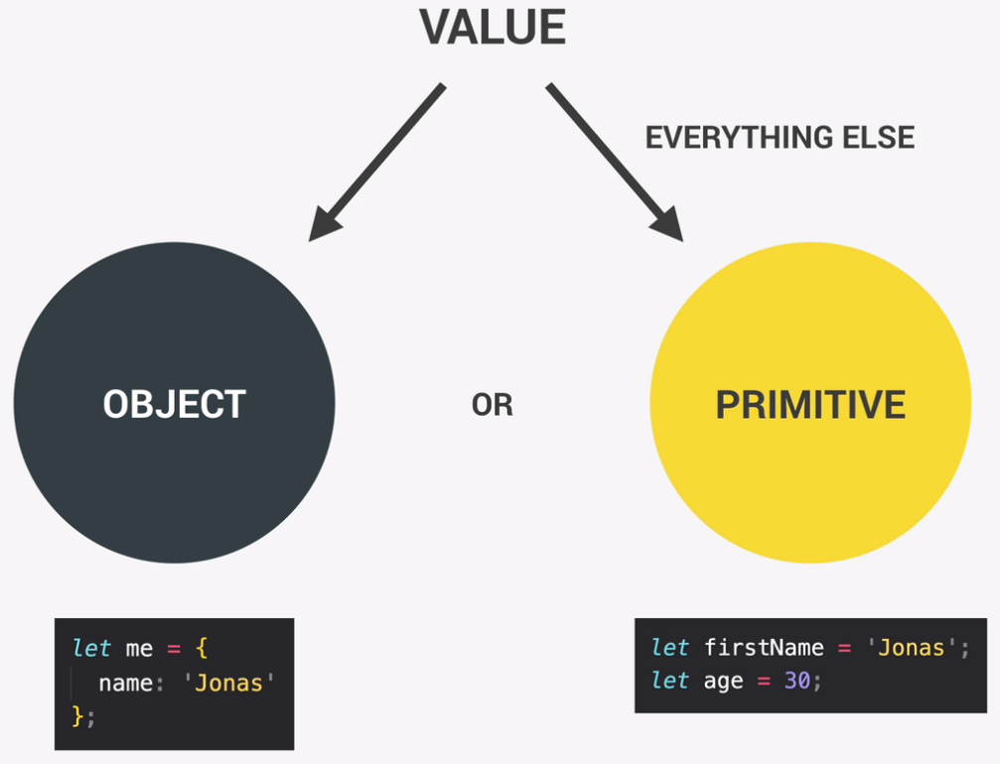

# JavaScript

## Content

- [Historic :clock7:](#historic-clock7)
- [Sources :link:](#sources-link)

## Historic :clock7:

[Go to content](#content)
|Date _YYYY-MM-DD_|Description|
|:-|:-|
|2023-06-26|Init|

## Strict mode

[Go to content](#content)
Use strict `use strict` at the beginning of the code to avoid bugs

- forbidd some things
- create visible errors

## Variable

[Go to content](#content)

### Overview

<br>

Primitive data types:

- Number
- String
- Boolean
- Undefined (empty value)
- Null (empty value)
- Symbol (ES2015)
- BigInt (ES2020)

### Declaration

_:warning: The variable declaration does not contain the type but the value does. :warning:_

```JavaScript
var a; // CREATE VARIABLE (OLD CALL)
let b; // CREATE VARIABLE
const c; // CREATE CONSTANTE VARIABLE
```

> _:pencil2: Example: _<br>
>
> ```JavaScript
> const a; // UNDEFINED TYPE
> a = "a"; // STRING TYPE
> a = 'a'; // STRING TYPE
> a = 1; // INTEGER TYPE
> ```

---

`type of ` returns the data type

## Type conversion and coercion

```JavaScript
// TYPE CONVERSION
const inputYear = '1991';
console.log(Number(inputYear), inputYear);
console.log(Number(inputYear) + 18);

console.log(Number('Jonas'));
console.log(typeof NaN);

console.log(String(23), 23);

// TYPE COERCION
console.log('I am ' + 23 + ' years old'); // RETURN STRING 'I am 23 years old'
console.log('23' - '10' - 3); // RETURN NUMBER 10
console.log('23' / '2'); // RETURN NUMBER 11.5

let n = '1' + 1; // RETURN STRING '11'
n = n - 1;
console.log(n);

```

## comparison operator `===` vs `==`

`===` strict mode: Variable must have the same type and value to get `true`
`==` coersion mode: Variable are converted to the same type and value must be the same to get `true`

> _:pencil2: Example:_<br>
>
> ```JavaScript
> const a = "1";
> const b = "1";
> const c = 1;
>
> // STRICT MODE
> a === b; // RETURN true
> a === c; // RETURN false
>
> // COERSION MODE
> a == b; // RETURN true
> a == c; // RETURN true
> ```

## Functions

### Function declaration

```JavaScript
function funcName(a1, a2) { // parameters a1 et a2
    // FUNCTION PROCESS
    return something;
}
funcName(); // CALLING FUNCTION
```

### Function expression

_:warning: It is not possible to call a function expression before its declaration :warning:_

```JavaScript
const value = function (a1) {
    return something;
}
const a = value('test'); // CALLING FUNCTION
```

### Arrow expression

```JavaScript
// ONLY ONE ARGUMENT AND ONE RETURN
const a = value => something;

// ONLY ONE ARGUMENT AND BLOCK CODE
const a = value => {
    const b = 'something';
    const c = 'something';
    return c;
}
console.log(value(42));

// SEVERAL ARGUMENTS AND BLOCK CODE
const a = (value1, value2) => {
    const b = 'something';
    const c = 'something';
    return c;
}
console.log(value(42));
```

## Array

```JavaScript
const myArray = [1, 2, 3];
console.log(myArray);
console.log(myArray[0]);

const myArray2 = new Array(1, 2, 3);

myArray.length(); // GET AMOUNT OF ARRAY

myArray[0] = 4; // CHANGE THE VALUE AT THE INDEX 0

const newLen = myArray.push(4); // ADD A NEW ELEMENT TO THE ARRAY AND RETURN NEW LENGTH OF THE ARRAY

const newLen = myArray.unshift(4); // ADD A NEW ELEMENT AT LEFT TO THE ARRAY AND RETURN NEW LENGTH OF THE ARRAY

const poped = myArray.pop(); // REMOVE THE LAST ELEMENT IN THE ARRAY AND RETURN THE REMOVED ELEMENT

const poped = myArray.shift(4); // REMOVE THE FIRST ELEMENT IN THE ARRAY AND RETURN THE REMOVED ELEMENT

myArray.indexOf(1); // RETURN INDEX POSITION OF THE SEARCHED ELEMENT, OTHERWISE -1 IS RETURNED IF NO FOUND ELEMENT

myArray.includes(1); // RETURN TRUE IF FOUND ELEMENT, OTHERWISE FALSE IS RETURNED IF NO FOUND ELEMENT
```

### Objects

Structure data

```JavaScript
const myObject = {
    firstName: 'a',
    lastName: 'b',
    age: 1,
    friends: ['in', 'out']
};
console.log(myObject); // DISPLAY EVERY DATA FROM THE OBJECT
console.log(myObject.lastName); // DISPLAY THE LAST NAME
console.log(myObject['lastName']) // DISPLAY THE LAST NAME BUT CAN HANDLE EXPRESSION

const nameKey = 'Name';
console.log(myObject['first' + nameKey]);
console.log(myObject['last' + nameKey]);

const a = prompt("What do you want to know about the object ?");
if (myObject[a]) {
    console.log(myObject[a]);
} else {
    console.log("Wrong reauest");
}

myObject.location = "France"; // ADD NEW FIELD
```

### Debugging

```JavaScript
console.log();
console.warn();
console.err();
console.tabe(object);

```

In Developper Tools WebBrowser, tab "Sources", it is possible to add breakpoint in the script.

## DOM

`Document Object Model`: Structured representation of html documents. Allows JavaScript to acess HTML elements and styles to manipulate them.
Connexion point between HTML document and JavaScript script.

It is part of WEB APIs (Application Programming Interface).

## Class

`contains`: check if the class value exists in the object.
`toggle`: set searched class value if not exists or unset searched class value if exists.

## Miscellaneous

Possible to write conditional ternary in `console.log`

Install node js "live-server"
`sudo npm install live-server -g`

## Sources :link:

[Go to content](#content)

### Basics

https://developer.mozilla.org/en-US/docs/Web/JavaScript/Reference/Operators/Operator_Precedence

```

```
