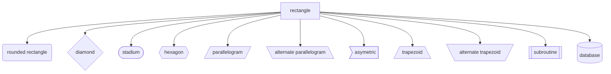

# template

## Content
- [Historic :clock7:](#historic-clock7)
- [Overview :mag:](#overview-mag)
- [Flowcharts](#flowcharts)
- [Sources :link:](#sources-link)

## Historic :clock7:
[Go to content](#content)
|Date _YYYY-MM-DD_|Description|
|:-|:-|
|20xx-xx-xx|Init|

## Overview :mag:
[Go to content](#content)
|Type|Description|
|:-|:-|
|Flowcharts||
|Diagrams||
|Pie||
|Gantt||
|Journey||

## Flowcharts
[Go to content](#content)

### Rules
Call: `Type Direction`  
- Type: `flowchart`  
- Direction: `TB, BT, RL, LR`  

### Shapes
|Code|Description|
|:-:|:-|
|[x]|Default rectangle|
|(x)|Rounded rectangle|
|{x}|Diamond|
|([x])|Stadium|
|((x))|Circle|
|{{x}}|Hexagon|
|[/x/]|Parallelogram|
|[\x\\]|Alternate parallelogram|
|\>x]|Asymetric|
|[/x\\]|Trapezoid|
|[\x/]|Alternate trapezoid|
|[[x]]|Subroutine|
|[(x)]|Database|

> :memo: x represents description of the shapes

### Examples

## Sources :link:
[Go to content](#content)
- https://mermaid.live/
