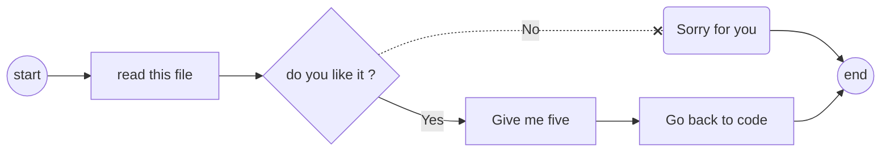
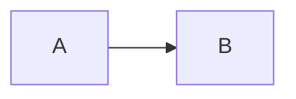
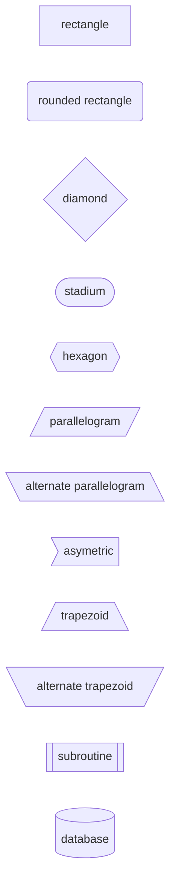

# mermaid

## Content
- [Historic :clock7:](#historic-clock7)
- [Overview :mag:](#overview-mag)
- [Flowcharts](#flowcharts)
- [Sources :link:](#sources-link)

## Historic :clock7:
[Go to content](#content)

|version|Date _YYYY-MM-DD_|Description|
|:-|:-|:-|
|v0.0|20xx-03-04|Init|

## Overview :mag:
[Go to content](#content)

The purpose of mermaid is to represent a graphic by writting text code in a text file as ".md | .html".
The easiest way to represent any idea/concept/flow with a lot of flexibility.

In case of usage in ".md" file from GitHub, you simply must define a code area as following:
- Write "mermaid" at the end of the first line of the code area.
- Define the graphical type on the second line and its direction.
- Define the content according to the graphical type defined.

_:pencil2: Example:_

\`\`\`mermaid  
flowchart LR  
A --> B  
\`\`\`  

Below are the different graphical type.
|Type|Description|
|:-|:-|
|Flowcharts||
|Diagrams||
|Pie||
|Gantt||
|Journey||

## Flowcharts
[Go to content](#content)

### Settings
- Type: `flowchart`  
- Direction: `TB, BT, RL, LR`  

> :memo: T=top | B=bottom | L=left | R=right

### Shapes
Below are the different shapes.
|Code|Description|
|:-:|:-|
|[x]|Default rectangle|
|(x)|Rounded rectangle|
|{x}|Diamond|
|([x])|Stadium|
|((x))|Circle|
|{{x}}|Hexagon|
|[/x/]|Parallelogram|
|[\x\\]|Alternate parallelogram|
|\>x]|Asymetric|
|[/x\\]|Trapezoid|
|[\x/]|Alternate trapezoid|
|[[x]]|Subroutine|
|[(x)]|Database|

> :memo: x represents description of the shapes

_:pencil2: Example:_

## Sources :link:
[Go to content](#content)

- :book: "The Official Guide to Mermaid.js: Create complex diagrams and beautiful flowcharts easily using text and code" by Knut Sveidqvist and Ashish Jain
- :globe\_with\_meridians: https://mermaid.live/
